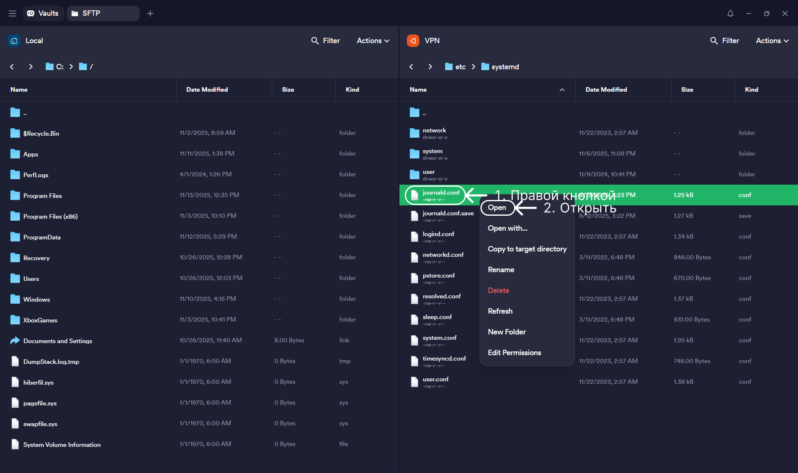
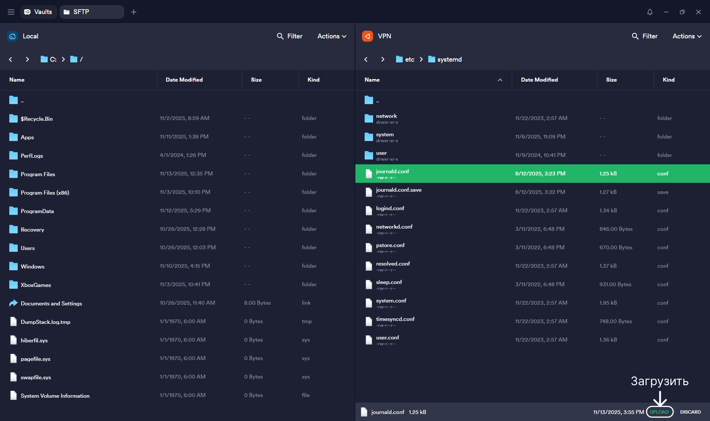

# Настройка Linux Ubuntu сервера

### Описание

В данной инструкции описываются основные шаги по первичной настройки сервера Linux Ubuntu c настройкой системы, ssh-подключений, пользователям и логированию.

### Содержание

- [1. Обновление системы](#1-обновление-системы)
- [2. Настройка системы пользователей](#2-настройка-системы-пользователей)
  - [2.1. Настройка SSH](#21-настройка-ssh)
  - [2.2. Настройка брандмауэра (UFW)](#22-настройка-брандмауэра-ufw)
  - [2.3. Создание и настройка нового пользователя](#23-создание-и-настройка-нового-пользователя)
  - [2.4. Настройка SSH-ключей - клиент](#24-настройка-ssh-ключей---клиент)
  - [2.5. Настройка SSH-ключей - сервер](#25-настройка-ssh-ключей---сервер)
  - [2.6. Отключение root](#26-отключение-root)
- [3. Настройка даты и времени](#3-настройка-даты-и-времени)
- [4. Ограничение логирование системы до 3-х дней](#4-ограничение-логирование-системы-до-3-х-дней)

### 1. Обновление системы

Перед началом настройки необходимо убедиться что сервер обновлён до последней актуальной версии (в конце сервер перезагрузиться):

```
sudo apt update && sudo apt upgrade -y && reboot
```

### 2. Настройка системы пользователей

Данные действия описаные в данном пункте не обязательны, но помогут существенно повысить безопасность сервера.

Для безопасного подключения к серверу не рекомендуется использовать root. Root имеет полный доступ к системе, и любая ошибка может привести к серьёзным последствиям.

### 2.1. Настройка SSH

Проверка работы SSH:

```
systemctl status ssh
```

Если SSH запущен, выведется данное сообщение:

`● ssh.service - OpenBSD Secure Shell server
   Loaded: loaded (/lib/systemd/system/ssh.service; enabled; vendor preset: enabled)
   Active: active (running)`

Если всё корректно, то можно перейти к <a href="#22-настройка-брандмауэра-ufw">пункту 2.2.</a>

Если выводиться `inactive` или `not found`, то SSH не установлен.

Устанавливаем SSH:

```
sudo apt install openssh-server -y
```

После установки необходимо его включить и проверить статус:

```
sudo systemctl enable ssh
```

```
sudo systemctl start ssh
```

```
systemctl status ssh
```

### 2.2. Настройка брандмауэра (UFW)

Необходимо включить брандмауэр и разрешить вход по SSH:

```
sudo ufw allow OpenSSH
```

Выводиться: `Rules updated и Rules updated (v6)`

```
sudo ufw enable
```

Спросит: `Command may disrupt existing ssh connections. Proceed with operation (y|n)?` - ответ: `y`

Проверка статуса:

```
sudo ufw status
```

Ответ сервера должен быть следующим: `Status: active`

### 2.3. Создание и настройка нового пользователя

Для безопасного и надёжного подключения к серверу рекомендуется подключаться не под root пользователем, а под отдельно созданным с правами sudo.

Создание пользователя (заменить "username" на желаемое имя):

```
sudo adduser username
```

Система подготовит пользователя, и предложит ввести пароль. Задаётся пароль 2 раза. Необходимо сохранить в надёжном месте.

По желанию можно ввести дополнительную информацию о пользователе, либо пропустить используя "Enter".

Добавление пользователя в группу sudo - выдаёт права администратора:

```
sudo usermod -aG sudo username
```

Проверить права (в выводе должна быть группа sudo):

```
sudo groups username
```

### 2.4. Настройка SSH-ключей - клиент

Данные действия можно делать по желанию.

На локальном компьютере (не на сервере), нужно для пользователя сгенерировать SSH-ключ:

Необходимо открыть командную строку и ввести команду:

```
ssh-keygen -t ed25519
```

Система будет выводить вопросы для ключей:

`Enter file in which to save the key` - путь сохранения файла. Можно указать свой путь куда сохранить ключ или использовать "Enter" для пропуска, и тогда файлы будут сохранены по пути который прописан, на примере: `(C:\Users\Admin/.ssh/id_ed25519)`

`Enter passphrase` - дополнительный пароль для защиты приватного ключа. Если его ввести, то при каждом подключении SSH будет спрашивать этот пароль. Если оставил пустым, то подключение будет происходить без запроса. Для текущей задачи можно пропустить.

`Enter same passphrase again:` - повтор пароля, если не вводился, то просто "Enter"

Ключ будет создан в следующие файлы: `/.ssh/id_ed25519` и `/.ssh/id_ed25519.pub`. Необходимо хранить в безопасном месте, чтобы не потерять.

Пример созданного ключа:


Файл `/.ssh/id_ed25519` нужно добавить в Termius вкладку ключи. Инструкция по SSH ключам: [Подключение к серверу по SSH ключу](/TERMIUS/README.md#3-подключение-к-серверу-по-ssh-ключу)

Файл `/.ssh/id_ed25519.pub` уже используется в настройке ключей на сервере.

### 2.5. Настройка SSH-ключей - сервер

На сервере под пользователем root, необходимо создать директорию для ключей нового пользователя и задать права ("username" заменить на действительное имя):

```
mkdir -p /home/username/.ssh
```

```
chmod 700 /home/username/.ssh
```

Далее в Termius открывается SFTP по корневому пути `/home/username/.ssh` и загружаем файл `id_ed25519.pub`.

Если папку .ssh не видно, необходимо включить отображение скрытых файлов.

В консоли выдаются права:

```
chmod 600 /home/username/.ssh/id_ed25519.pub
```

Абсолютно все "username" подменяются на действительное имя:

```
chown -R username:username /home/username/.ssh
```

### 2.6. Отключение root

Внимание! Будьте осторожны при отключении root-пользователя. Так как обычный пользователь даже с root правами не сможет редактировать системные файлы через SFTP, например: `/etc/ssh/sshd_config`. Все изменения придётся выполнять через командную строку с использованием sudo.

Пример команды:

```
sudo nano /etc/ssh/sshd_config
```

Для отключения root пользователя:

По SFTP открывает в корневом каталоге: `/etc/ssh/sshd_config`

```
PermitRootLogin yes
```

Меняем на:

```
PermitRootLogin no
```

Если нужно только по SSH ключу без пароля:

```
#PasswordAuthentication yes
```

Меняем на:

```
PasswordAuthentication no
```

Перезапуск SSH:

```
sudo systemctl restart ssh
```

### 3. Настройка даты и времени

Проверка текущих настроек:

```
timedatectl
```

Установка часового пояса по Москве (если необходимо по другому часовому поясу, то подставляем свой):

```
sudo timedatectl set-timezone Europe/Moscow
```

Установка времени вручную (если необходимо):

```
sudo timedatectl set-time '2025-12-31 23:59:59'
```

### 4. Ограничение логирование системы до 3-х дней

Система постоянно логирует свои действия, и может накапливать данные, и для того чтобы данное действие ограничить, нужно задать ему параметры.

Проверка размера текущих логов:

```
journalctl --disk-usage
```

Очистка записанных логов, оставив только записи за последние 3 дня

```
sudo journalctl --vacuum-time=3d
```

Для постоянного ограничения размера логов, необходимо открыть системный файл и сделать ограничение.

Открываем SFTP, выбираем сервер и переходим в корневой каталог. Как пользоваться SFTP есть в инструкции: <a href="/TERMIUS/README.md">Настройка Termius</a>.

Далее по пути: /etc/systemd/ ищем файл journald.conf:



Открыть файл можно через блокнот или другую предпочтительную программу:


Необходимо найти строку:

```
#MaxRetentionSec=
```

Заменить на:

```
MaxRetentionSec=3day
```

Сохранить и закрыть блокнот. Далее в Termius появиться снизу панель, где загружаем файл:



Перезапускаем службу:

```
sudo systemctl restart systemd-journald
```

Для полной надёжности можно перезагрузить сервер полностью после всех изменений.
