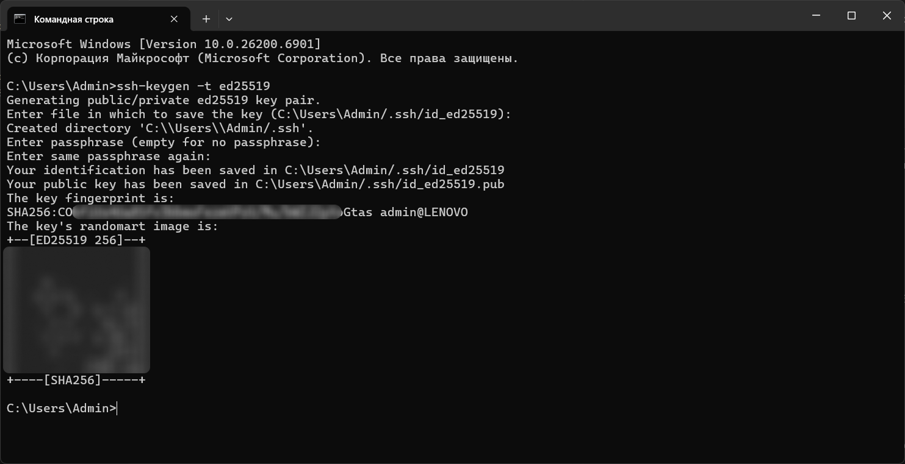
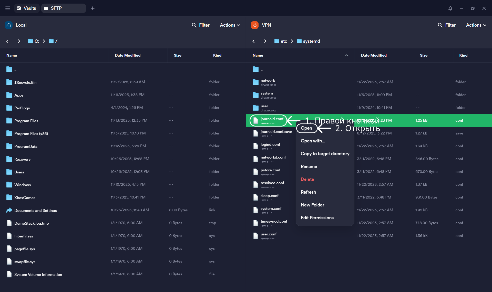
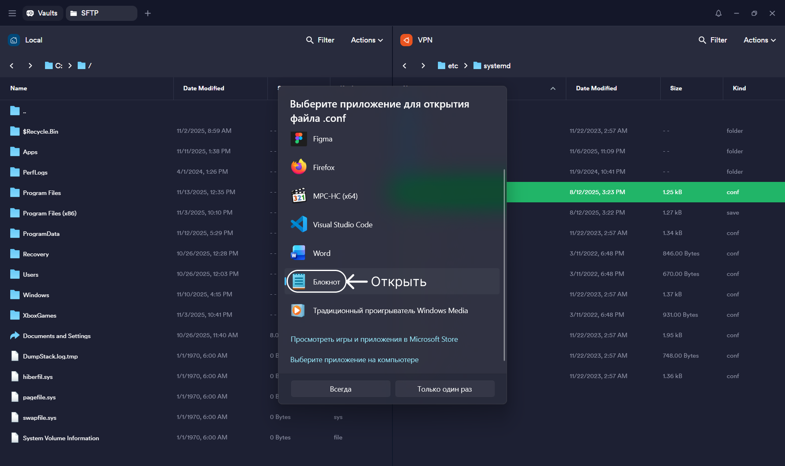
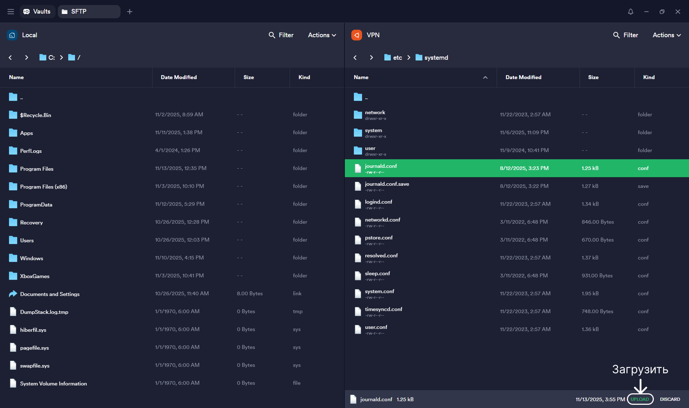

# Настройка Linux Ubuntu сервера

В данной инструкции описываются основные шаги по первичной настройки сервера Linux Ubuntu c настройкой системы, ssh-подключений, пользователям и логированию.

<br />

## Содержание

- [1. Обновление системы](#1-обновление-системы)
- [2. Настройка системы пользователей](#2-настройка-системы-пользователей)
  - [2.1. Настройка SSH](#21-настройка-ssh)
  - [2.2. Настройка брандмауэра (UFW)](#22-настройка-брандмауэра-ufw)
  - [2.3. Создание и настройка нового пользователя](#23-создание-и-настройка-нового-пользователя)
  - [2.4. Настройка SSH-ключей - клиент](#24-настройка-ssh-ключей---клиент)
  - [2.5. Настройка SSH-ключей - сервер](#25-настройка-ssh-ключей---сервер)
  - [2.6. Отключение пароля и root пользователя](#26-отключение-пароля-и-root-пользователя)
- [3. Настройка даты и времени](#3-настройка-даты-и-времени)
- [4. Ограничение логирование системы до 3-х дней](#4-ограничение-логирование-системы-до-3-х-дней)

<br />

## 1. Обновление системы

Перед началом настройки необходимо убедиться что сервер обновлён до последней актуальной версии (в конце сервер перезагрузиться):

```bash
sudo apt update && sudo apt upgrade -y && reboot
```

<br />

## 2. Настройка системы пользователей

Данные действия описаные в данном пункте не обязательны, но помогут существенно повысить безопасность сервера.

Для безопасного подключения к серверу не рекомендуется использовать root. Root имеет полный доступ к системе, и любая ошибка может привести к серьёзным последствиям.

### 2.1. Настройка SSH

Проверка работы SSH:

```bash
systemctl status ssh
```

Если SSH запущен, выведется данное сообщение:

`● ssh.service - OpenBSD Secure Shell server
   Loaded: loaded (/lib/systemd/system/ssh.service; enabled; vendor preset: enabled)
   Active: active (running)`

Если всё корректно, то можно перейти к [пункту 2.2.](#22-настройка-брандмауэра-ufw)

Если выводиться `inactive` или `not found`, то SSH не установлен.

Устанавливаем SSH:

```bash
sudo apt install openssh-server -y
```

После установки необходимо его включить и проверить статус:

```bash
sudo systemctl enable ssh
```

```bash
sudo systemctl start ssh
```

```bash
systemctl status ssh
```

### 2.2. Настройка брандмауэра (UFW)

Необходимо включить брандмауэр и разрешить вход по SSH:

```bash
sudo ufw allow OpenSSH
```

Выводиться: `Rules updated и Rules updated (v6)`

```bash
sudo ufw enable
```

Спросит: `Command may disrupt existing ssh connections. Proceed with operation (y|n)?` - ответ: `y`

Проверка статуса:

```bash
sudo ufw status
```

Ответ сервера должен быть следующим: `Status: active`

### 2.3. Создание и настройка нового пользователя

Для безопасного и надёжного подключения к серверу рекомендуется подключаться не под root пользователем, а под отдельно созданным с правами sudo.

Создание пользователя (заменить "username" на желаемое имя):

```bash
sudo adduser username
```

Система подготовит пользователя, и предложит ввести пароль. Задаётся пароль 2 раза. Необходимо сохранить в надёжном месте.

По желанию можно ввести дополнительную информацию о пользователе, либо пропустить используя "Enter".

Добавление пользователя в группу sudo - выдаёт права администратора:

```bash
sudo usermod -aG sudo username
```

Проверить права (в выводе должна быть группа sudo):

```bash
sudo groups username
```

### 2.4. Настройка SSH-ключей - клиент

Данные действия можно выполнять по желанию.
SSH-ключ используется для входа на сервер без ввода пароля и является более надёжным способом аутентификации.

На локальном компьютере (не на сервере), необходимо сгенерировать SSH-ключ. Откройте командную строку и введите команду:

```bash
ssh-keygen -t ed25519
```

Система задаст несколько вопросов:

`Enter file in which to save the key` - путь сохранения файла. Можно указать свой путь куда сохранить ключ или использовать "Enter" для пропуска, и тогда файлы будут сохранены по пути который прописан, на примере: `(C:\Users\Admin/.ssh/id_ed25519)`

`Enter passphrase` - дополнительный пароль для защиты приватного ключа. Если его ввести, то при каждом подключении SSH будет спрашивать этот пароль. Если оставил пустым, то подключение будет происходить без запроса. Для текущей задачи можно пропустить.

`Enter same passphrase again:` - повтор пароля, если не вводился, то просто "Enter"

Ключ будет создан в следующие файлы: `/.ssh/id_ed25519` и `/.ssh/id_ed25519.pub`. Необходимо хранить в безопасном месте, чтобы не потерять.

Пример созданного ключа:



Приватный ключ `/.ssh/id_ed25519` нужно добавить в Termius вкладку ключи. Инструкция по SSH ключам: [Подключение к серверу по SSH ключу](/TERMIUS/README.md#3-подключение-к-серверу-по-ssh-ключу)

### 2.5. Настройка SSH-ключей - сервер

На сервере под пользователем root, необходимо создать директорию для ключей нового пользователя и задать права ("username" заменить на действительное имя):

```bash
mkdir -p /home/username/.ssh
```

```bash
chown -R username:username /home/username/.ssh
```

```bash
chmod 700 /home/username/.ssh
```

Файл `/.ssh/id_ed25519.pub` уже используется на сервере. Его нужно загрузить через SFTP в папку `.ssh` уже под созданным пользователем. Пример корневого пути: `/home/username/.ssh`

Если папку .ssh не видно, необходимо включить отображение скрытых файлов.

После этого на сервере переключиться на созданного пользователя:

```bash
su - username
```

И выдаём права доступа с добавлением ключа в файл authorized_keys:

```bash
chmod 700 ~/.ssh
```

```bash
cat ~/.ssh/id_ed25519.pub >> ~/.ssh/authorized_keys
```

```bash
chmod 600 ~/.ssh/authorized_keys
```

```bash
rm ~/.ssh/id_ed25519.pub
```

Теперь можно подключаться к созданому пользователю через ssh ключ.

### 2.6. Отключение пароля и root пользователя

ВНИМАНИЕ! Перед отключеним root пользователя, советуется пройти пункт 3 и 4, а затем вернуться обратно:

- [3. Настройка даты и времени](#3-настройка-даты-и-времени)
- [4. Ограничение логирование системы до 3-х дней](#4-ограничение-логирование-системы-до-3-х-дней)

ВНИМАНИЕ! Будьте осторожны при отключении root пользователя и входа по паролю. Пользователь root не сможет войти в систему до тех пор, пока не будет изменён системный файл. Также все изменения придётся выполнять созданного пользователя с правами sudo.

Если всё же пользователя root нет желания отключать, можно также сделать подключение по ssh ключу, также как и при подключении обычного пользователя. Это будет лучше чем пароль, но всё же так же не безопасно.

Заходим по созданным пользователем на примере "username", и открываем системный файл:

```bash
sudo nano /etc/ssh/sshd_config
```

Файл откроется внутри консоли, к сожалению редактировать по другому системные файлы нельзя, так как нужен пароль пользователя под sudo, а Termius пока не сделали такой способ для обновления файлов по SFTP.

Для отключения root, ищем строку:

```bash
PermitRootLogin yes
```

Меняем на:

```bash
PermitRootLogin no
```

Для отключения входа только по SSH ключу без пароля:

```bash
#PasswordAuthentication yes
```

Меняем на:

```bash
PasswordAuthentication no
```

Для того чтобы сохранить файл нужно использовать следующее сочетание клавиш: `ctrl+x`, `y`, `Enter`.

Далее нужно перезапустить SSH:

```bash
sudo systemctl restart ssh
```

<br />

## 3. Настройка даты и времени

Проверка текущих настроек:

```bash
timedatectl
```

Установка часового пояса по Москве (если необходимо по другому часовому поясу, то подставляем свой):

```bash
sudo timedatectl set-timezone Europe/Moscow
```

Установка времени вручную (если необходимо):

```bash
sudo timedatectl set-time '2025-12-31 23:59:59'
```

<br />

## 4. Ограничение логирование системы до 3-х дней

Система постоянно логирует свои действия, и может накапливать данные, и для того чтобы данное действие ограничить, нужно задать ему параметры.

Проверка размера текущих логов:

```bash
journalctl --disk-usage
```

Очистка записанных логов, оставив только записи за последние 3 дня

```bash
sudo journalctl --vacuum-time=3d
```

Для постоянного ограничения размера логов, необходимо открыть системный файл и сделать ограничение.

Открываем SFTP, выбираем сервер и переходим в корневой каталог. Как пользоваться SFTP есть в инструкции: [🔑 Настройка Termius](../TERMIUS/README.md).

Далее по пути ищем файл: `/etc/systemd/journald.conf`:



Открыть файл можно через блокнот или другую предпочтительную программу:



Необходимо найти строку:

```bash
#MaxRetentionSec=
```

Заменить на:

```bash
MaxRetentionSec=3day
```

Сохранить и закрыть блокнот. Далее в Termius появиться снизу панель, где загружаем файл:



Перезапускаем службу:

```bash
sudo systemctl restart systemd-journald
```

Для полной надёжности можно перезагрузить сервер полностью после всех изменений.
