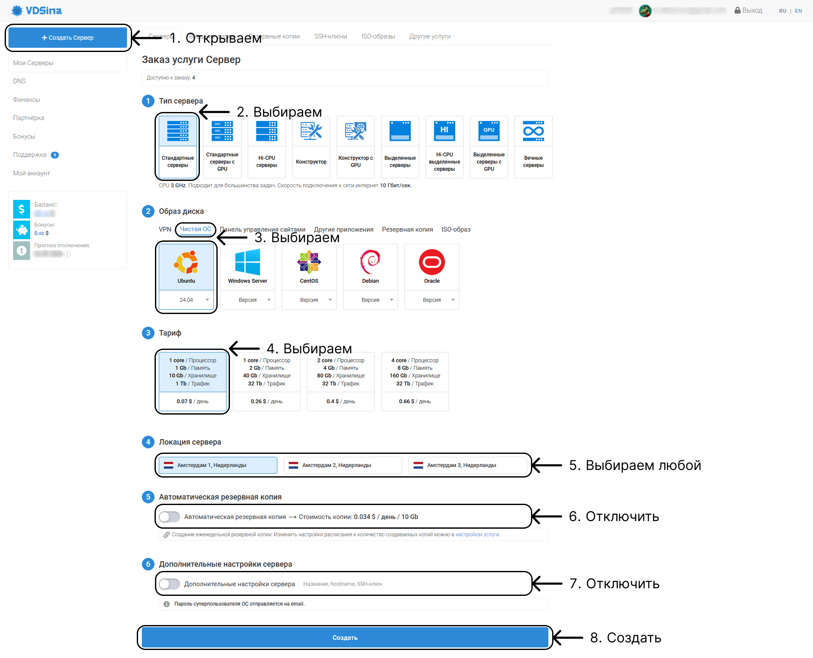
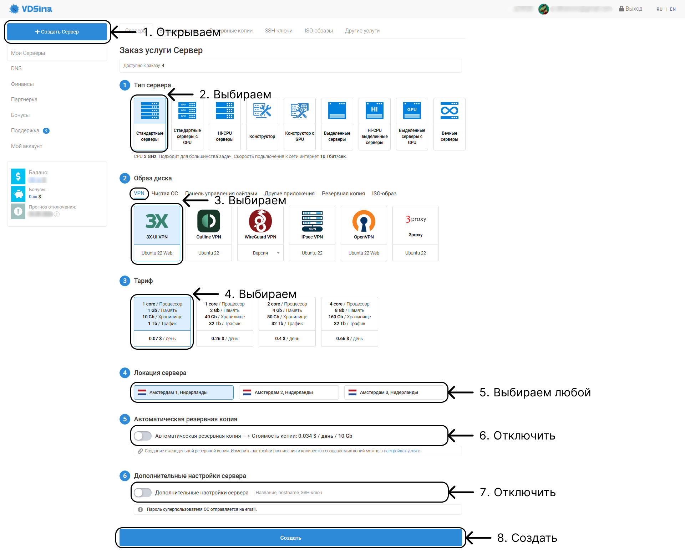
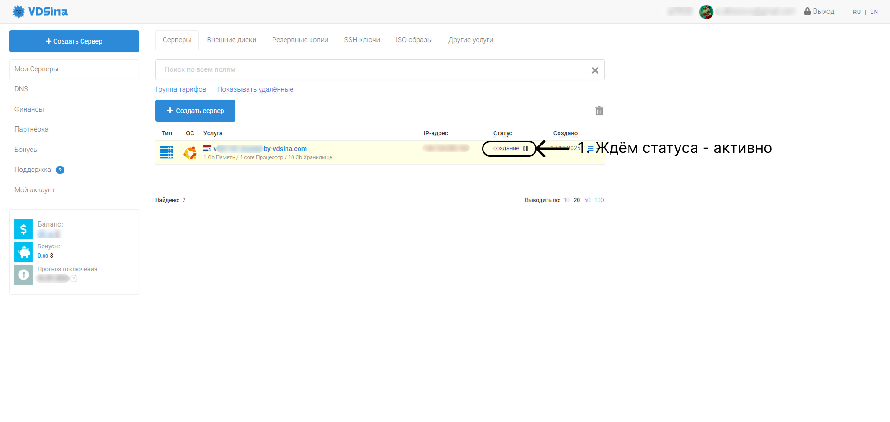
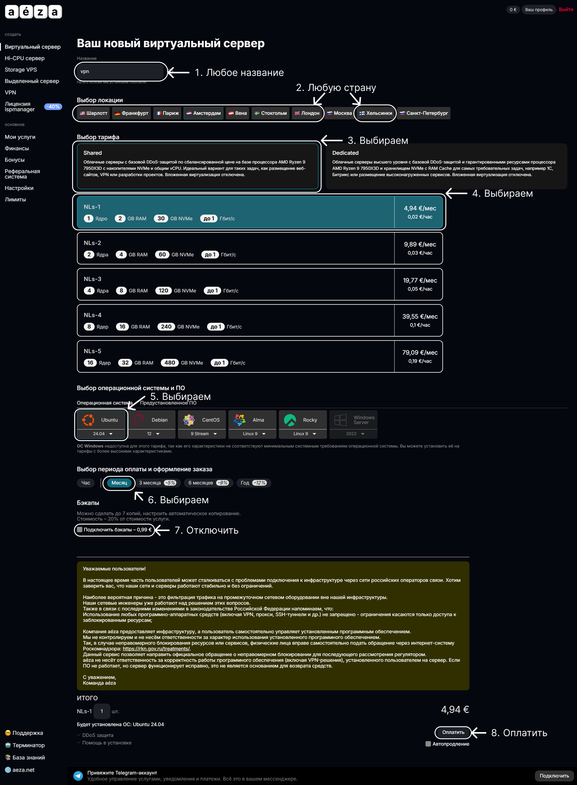
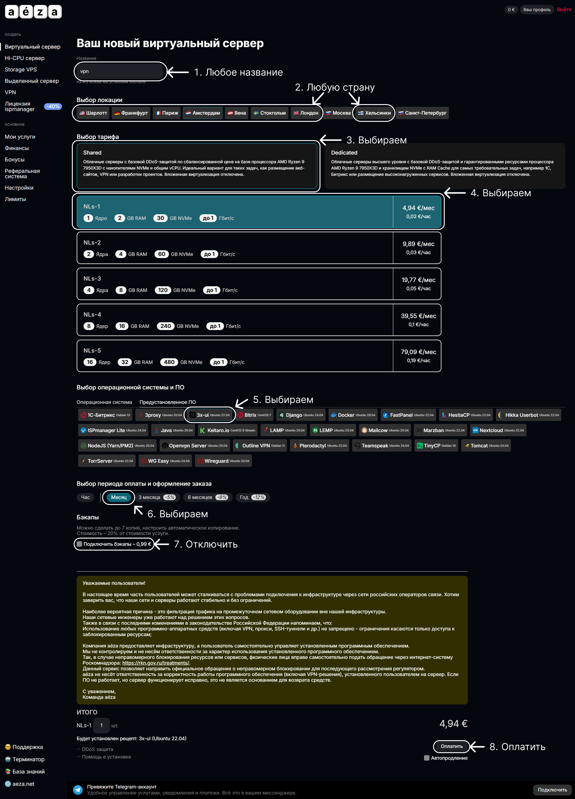
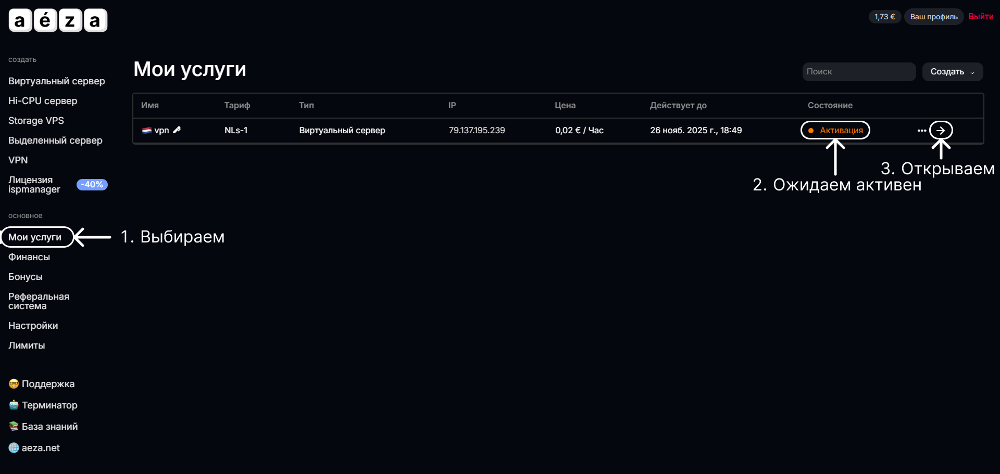

# Покупка сервера

### Описание

В данной инструкции описывается процесс выбора хостинга, покупки сервера и оплаты. Учитывая момент с оплатой только в определённой валюте например доллар.

### Содержание

- [1. Создание сервера](#1-создание-сервера)
  - [1.1. vdsina.com](#11-vdsinacom)
  - [1.2. aeza.net](#12-aezanet)

### 1. Создание сервера

Первым делом необходимо создать сервер, для подобного действия подойдёт самый простой и дешёвый linux ubuntu 24.04. Можно выбрать любой хостинг подходящий. Примеры хостинг сервисов:

- timeweb
- vdsina
- aeza

В примере аренды сервера используется хостинг vdsina и aeza, но лучше выбрать тот что находиться на территории страны, для надёжности.

#### 1.1. vdsina.com

После регистрации на хостинге создаём сервер, выбираем данные пункты (на данном изображении создаём чистый сервер).

Тут можно как раз посмотреть стоимость сервера, и далее потом пополнить баланс.

После оплаты и создание сервера ожидаем статуса - активно, после чего можно подключаться к серверу. Ожидае может быть продолжительным.

После активации, и открытии сервера, можно посмотреть данные по серверу: его IP-адрес и пароль для подключения.

#### 1.2. aeza.net

После регистрации на хостинге создаём сервер, выбираем "Виртуальный хостинг":

На данном изображении создаём чистый сервер:

Переходим в пункт "Мои услуги", ожидаем активации, и переходим на сам сервер:

После активации, и открытии сервера, можно посмотреть данные по серверу: его IP-адрес и пароль для подключения.

