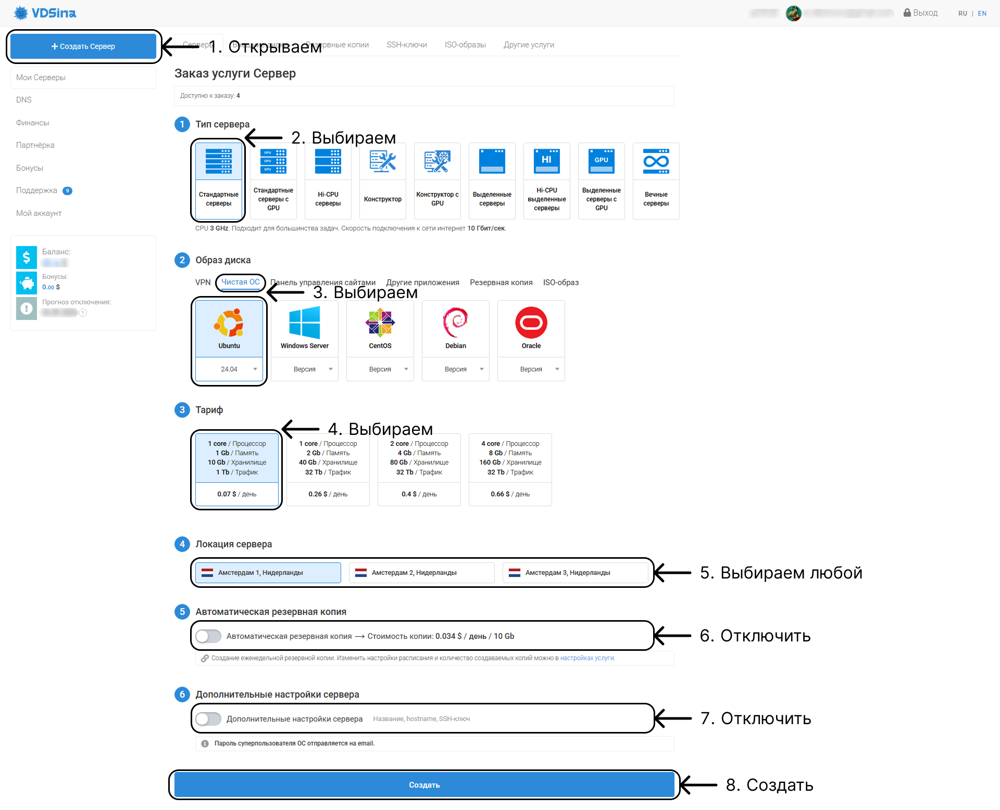
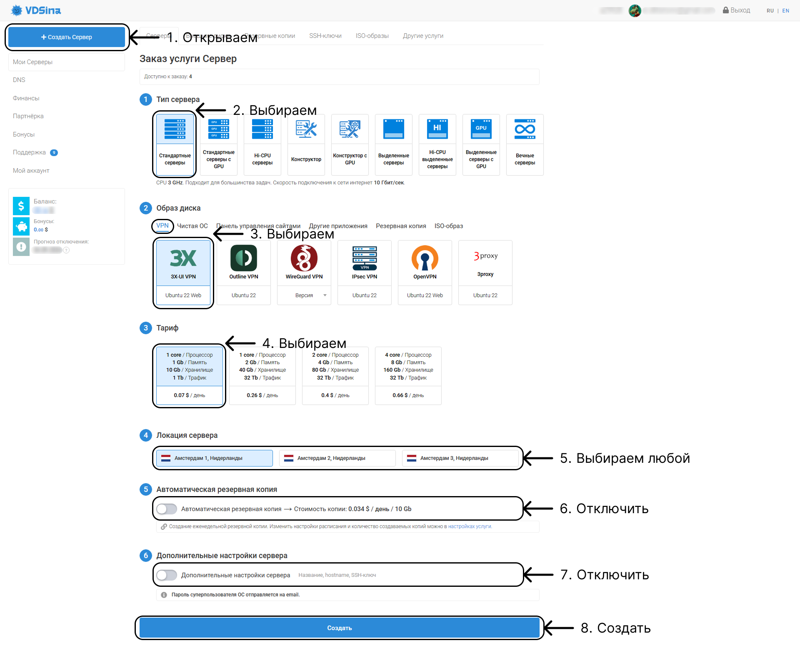
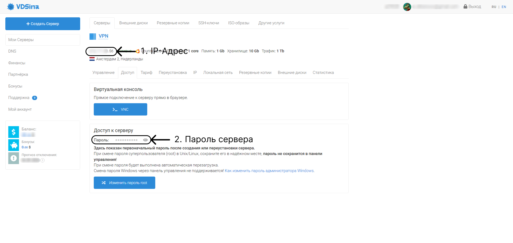
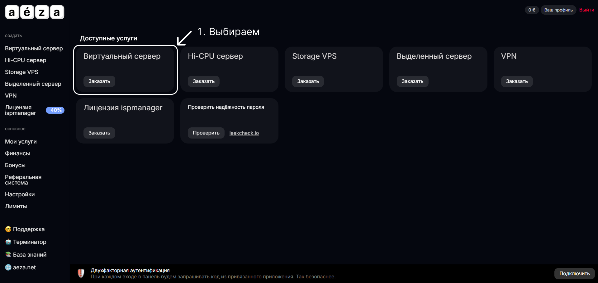
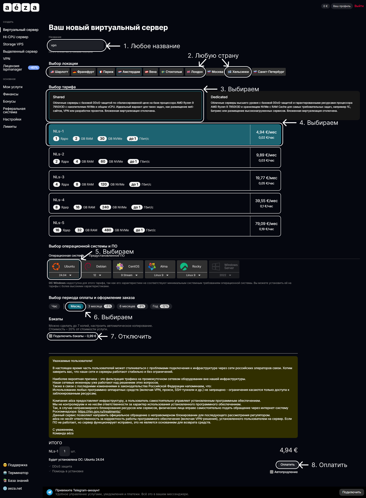
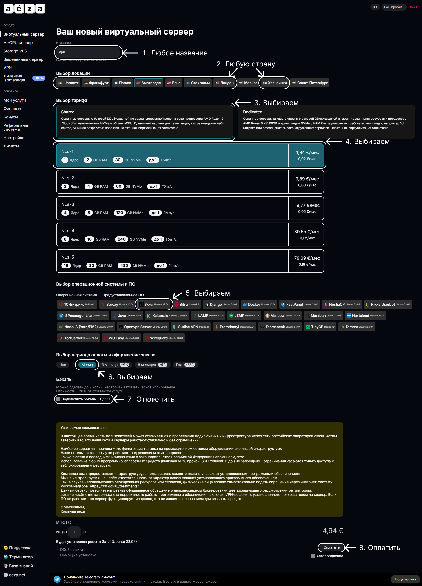
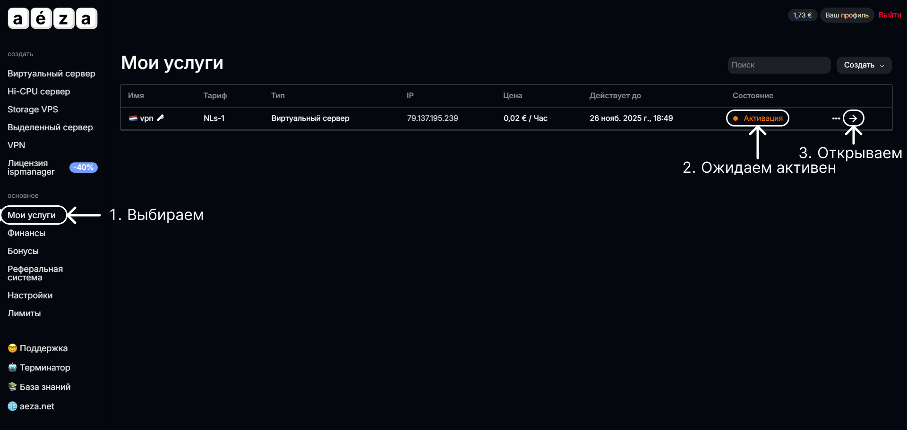
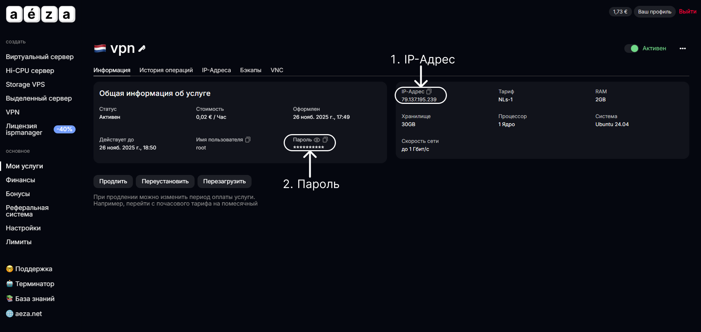

# Покупка сервера

В данной инструкции описывается процесс выбора хостинга, покупки сервера и оплаты. Учитывая момент с оплатой только в определённой валюте например доллар.

 

## Содержание

- [1. Хостинги](#1-хостинги)
  - [1.1. vdsina.com](#11-vdsinacom)
  - [1.2. aeza.net - НЕ АКТУАЛЬНО](#12-aezanet---не-актуально)
- [2. Сервисы с оплатой](#2-сервисы-с-оплатой)
  - [2.1. Плати легко](#21-плати-легко)
  - [2.2. Wanttopay](#22-wanttopay)
  - [2.3. CinCin Cards](#23-cincin-cards)

 

## 1. Хостинги

### 1.1. vdsina.com

После регистрации на хостинге создаём сервер, выбираем данные пункты (на данном изображении создаём чистый сервер).

Тут вы можете как раз посмотреть стоимость сервера, и далее потом пополнить баланс в иностранной валюте с помощью различных сервисов оплаты.

В случае если не планируется вручную всё настраиваться, то можно воспользоваться готовой конфигурацией:

После оплаты и создание сервера ожидаем статуса - активно, после чего можно подключаться к серверу. Ожидае может быть продолжительным.

После активации, и открытии сервера, можно посмотреть данные по серверу: его IP-адрес и пароль для подключения.

Сервис хороший в плане серверов, стабильно работает, однако сообщения от руководителя в виде информационных сообщений не всегда самые хорошие, и могут быть очень агрессивными.

Пример: если РКН заблокировал какой-то сервис, то хостинг может написать не самое приятное информационное сообщение (всем клиентам хостинга).

Нужно быть осторожным в выборе данного сервиса.

### 1.2. aeza.net - НЕ АКТУАЛЬНО

После регистрации на хостинге создаём сервер, выбираем "Виртуальный хостинг":

На данном изображении создаём чистый сервер:

В случае если не планируется вручную всё настраиваться, то можно воспользоваться готовой конфигурацией:

Переходим в пункт "Мои услуги", ожидаем активации, и переходим на сам сервер:

После активации, и открытии сервера, можно посмотреть данные по серверу: его IP-адрес и пароль для подключения.

Сервис в целом хороший, работает стабильно, но иногда IP-Адрес может быть заблокирован РКН например, и тогда нужно обращаться в поддержку для замены, или делать новый сервер.

 

## 2. Сервисы с оплатой

### 2.1. Плати легко

Сайт - <a href="https://pay-saas.ru">https://pay-saas.ru</a>

Платформа для финансовых услуг для граждан и компаний РФ. Основные возможности:

- Оплата зарубежных сервисов и подписок для физлиц.
- Ежемесячная оплата корпоративных зарубежных сервисов для юрлиц.
- Приём и отправка переводов (в т.ч. SWIFT/IBAN).
- Эквайринг от зарубежных клиентов с зачислением средств в РФ.
- Вывод средств за рубеж и хранение валюты на иностранных счетах.
- Приём и доставка посылок от зарубежных магазинов, не отправляющих в РФ.

Плюсы: работает стабильно, общение через менеджера.

Минусы: долгие ответы (1–2 часа на выпуск временной карты). Есть предположение что компания является посредником.

### 2.2. Wanttopay

Telergam бот - <a href="https://t.me/WantToPayBot">@WantToPayBot</a>

Мини-приложение для быстрого выпуска виртуальных карт Visa/Mastercard для международных онлайн-покупок. Баланс можно пополнять в рублях и криптовалюте. Есть карты с поддержкой Apple Pay для офлайн-оплаты за рубежом.

Плюсы: возможность выпуска собственной карты.

Минусы: практический опыт работы с сервисом отсутствует.

### 2.3. CinCin Cards

Telergam бот - <a href="https://t.me/CinCinR_bot">@CinCinR_bot</a>

Мини-приложение для быстрого выпуска виртуальных карт для международных онлайн-покупок. Баланс можно пополнять в рублях. Есть карты с поддержкой Apple Pay для офлайн-оплаты за рубежом.

Плюсы: возможность выпуска собственной карты.
