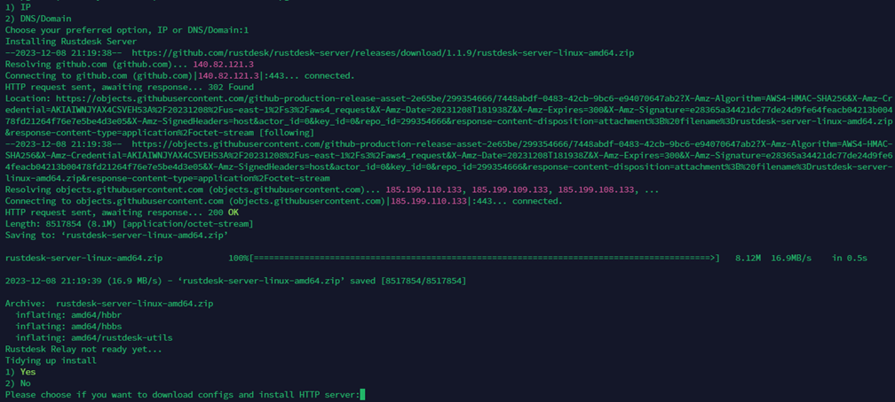
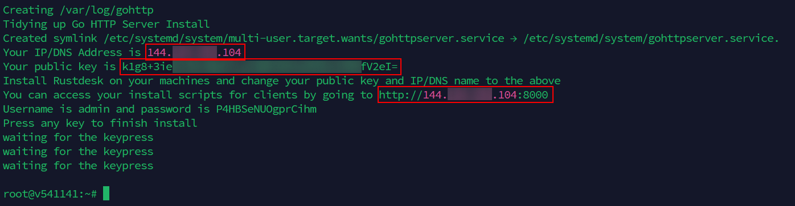
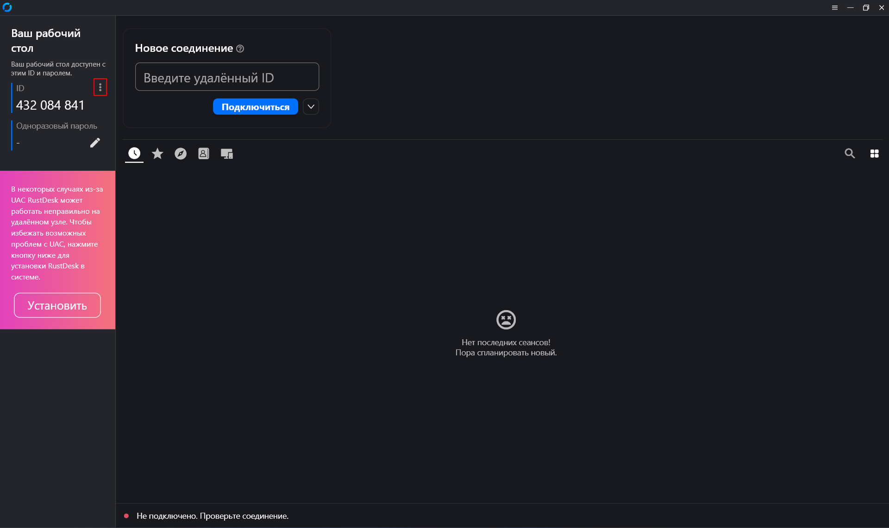
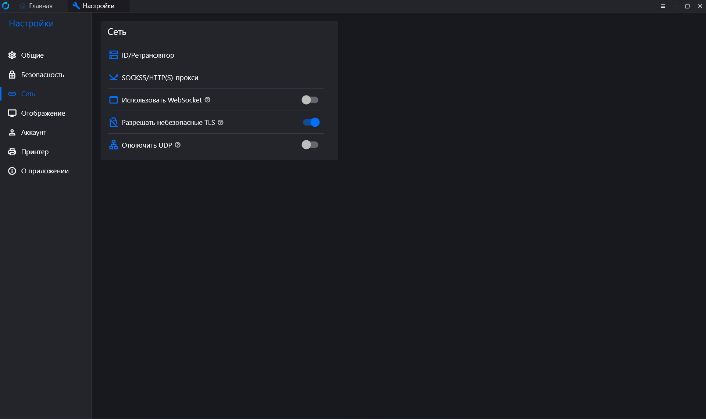
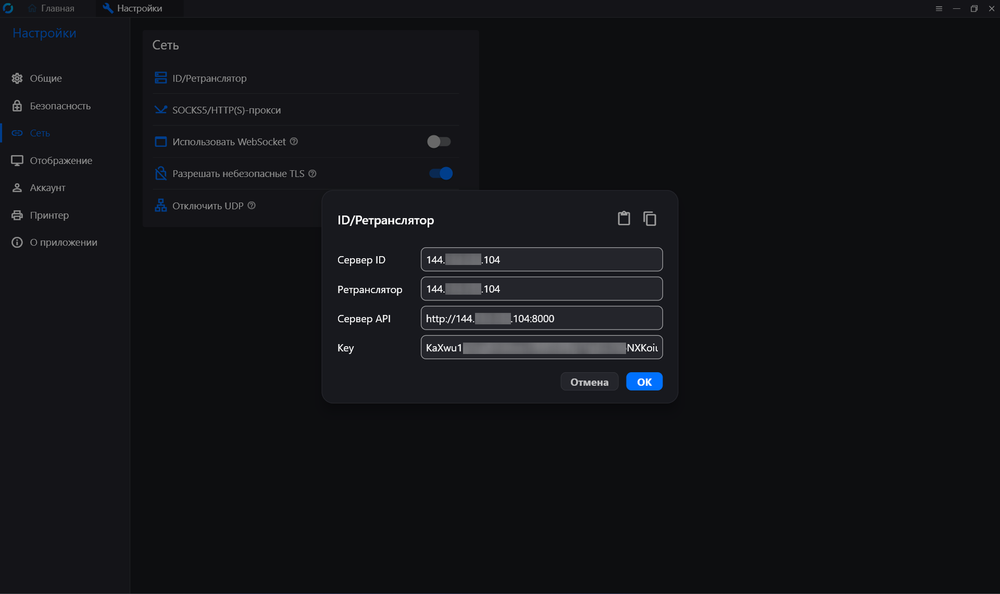
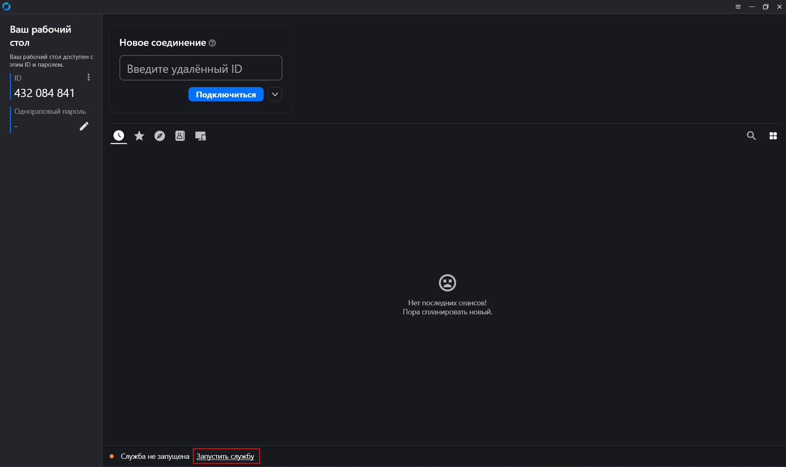

# Установка и настройка RustDesk

### Описание

Установка скрипта на сервер для работы с RustDesk и настройкой сервера для корректной работы. Настройка подключения программы RustDesk.

### Содержание

- [1. Открытие портов на сервере](#1-открытие-портов-на-сервере)
- [2. Установка скрипта на сервере](#2-установка-скрипта-на-сервере)
- [3. Настройка RustDesk](#2-установка-скрипта-на-сервере)
- [4. Дополнительно](#4-дополнительно)

### 1. Открытие портов на сервере

Для того чтобы было корректное соединение, можем убедиться что все порты открыты и работают:

```
sudo ufw allow http
```

```
sudo ufw allow https
```

```
sudo ufw default allow outgoing
```

```
sudo ufw allow 8000/tcp
```

```
sudo ufw allow 22/tcp
```

```
sudo ufw allow ssh
```

```
sudo ufw allow 21114:21119/tcp
```

```
sudo ufw allow 21116/udp
```

```
sudo ufw status
```

Итоговый результат должен быть таким (если список больше, то ничего страшного):


### 2. Установка скрипта на сервере

Устанавливаем необходимые библотеки:

```
sudo apt install wget git nano net-tools -y
```

Далее скачиваем скрипт для установки:

```
sudo wget https://raw.githubusercontent.com/eugeneviktorov/ServerRustDesk/main/install.sh
```

Или если нет возможности его скачать, что-то пошло не так например, то можно с помощью Termius через SFTP просто скопировать файл на сервер: <a href="/install.sh">файл</a>

```
sudo chmod +x install.sh
```

```
sudo ./install.sh
```

После того как пройдёт установка выбираем IP, пишем `1`.


Ожидаем и потом выбираем Yes – `1`.



После установки выдаётся результат

1. IP-адрес сервера (он нам ранее уже известен)
2. public key который используем в самом RustDesk

Необходимо записать выделенные данные к себе. Например в текстовый документ.



### 3. Настройка RustDesk

Программу необходимо скачать с репозитория <a href="https://github.com/rustdesk/rustdesk/releases">Github</a>

Скачиваем под нужную систему. Установить можно по желанию.

Нажимаем три точки рядом с ID, где сразу откроются настройки:



Пункт «Сеть» где необходимо разблочировать сетевые настройки и перейти в пункт `ID/Ретранслятор`:



Вводим данные, которые сохранены в текстовом документе, и нажимаем применить:



Если всё верно сделано, то на главном экране снизу будет статус «Успешно».


При первом старте может занять пару минут загрузка. Иногда нужно закрыть программу и открыть снова.

И также если пишет что служба не запущена, то запускаем:



Всё настроено. Данные которые были сохранены в текстовый документ нужно передать другому пользователю, и повторить процедуру в программе RustDesk, также ввести данные в ID/Ретранслятор. После чего можно пользоваться программой.

### 4. Дополнительно

В некоторых случаях необходимо чтобы программа работала до входа в пользователя системы. Для этого необходимо создать службу из программы RustDesk на ПК. Используем команду в командной строке от имени администратора:

```
sc create RustDesk binPath= "\"C:\Program Files\RustDesk\rustdesk.exe\" --service"
```

В случае если нужно будет потом удалить службу:

В программе «службы» найти и остановить сервис RustDesk, после чего также через командную строку с правами администратора удалить её:

```
sc delete RustDesk Service
```
