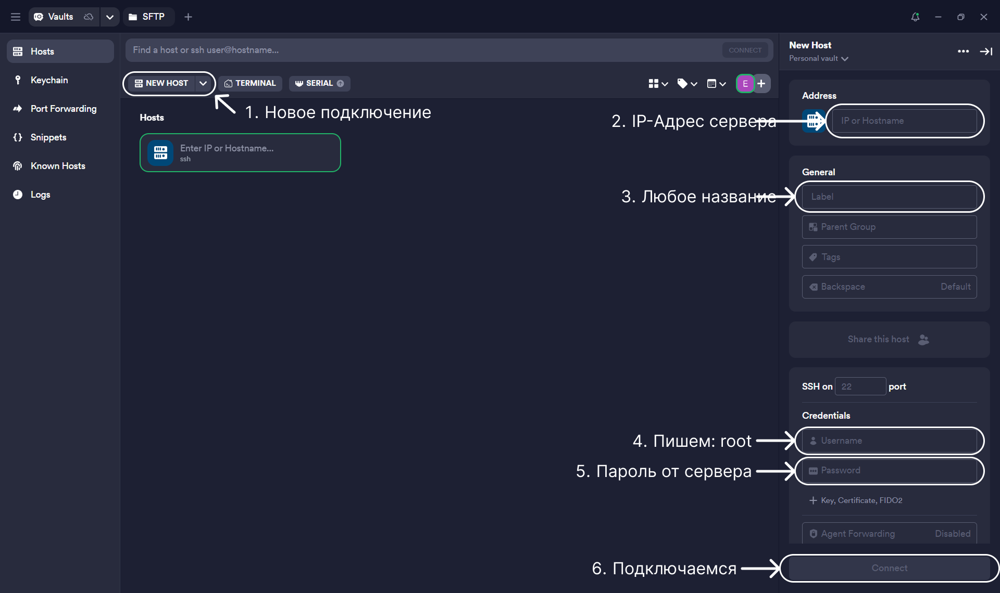
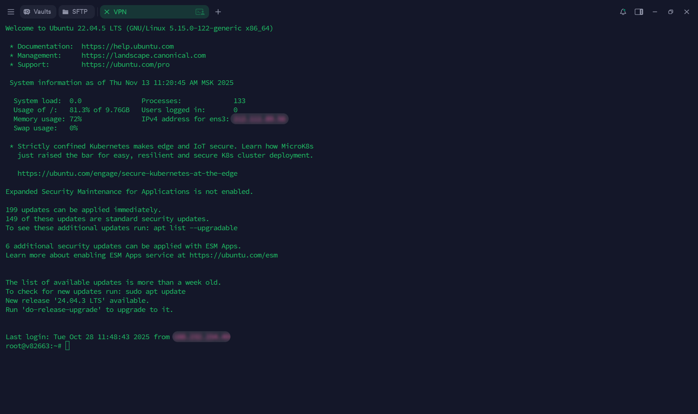
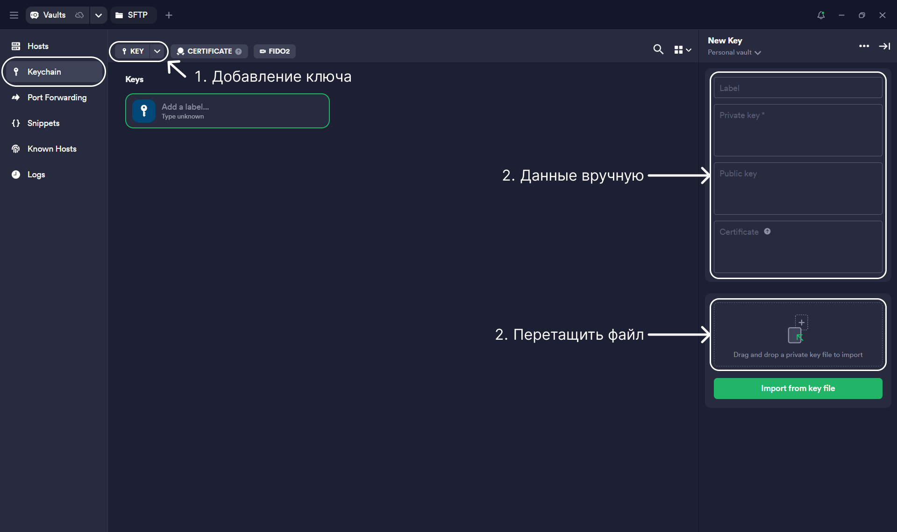
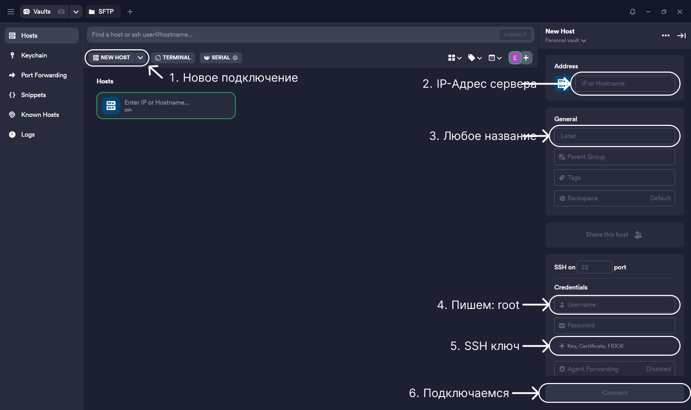
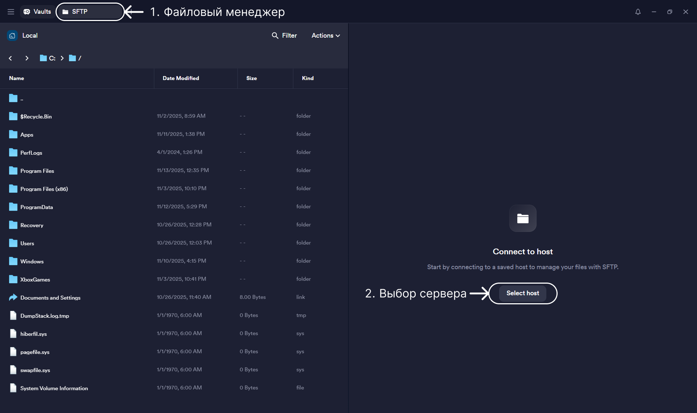
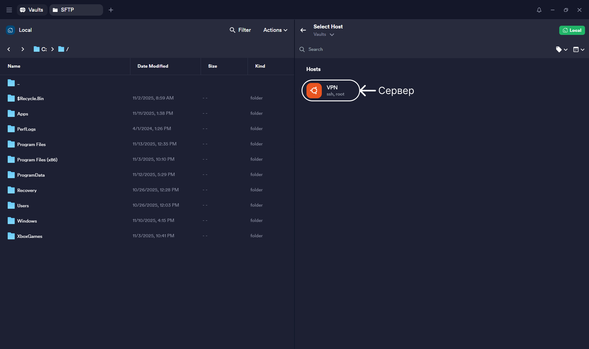
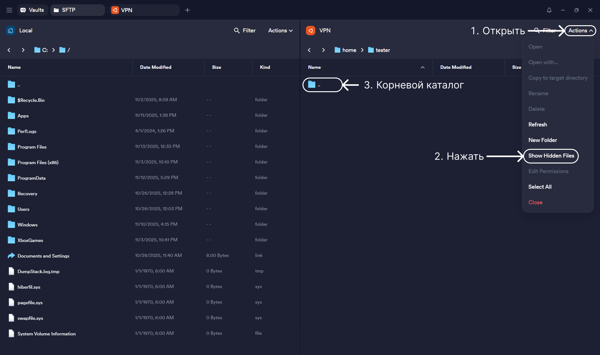

# Настройка Termius

### Описание

Termius - это современный SSH-клиент, который позволяет удобно подключаться к серверам. Он имеет приятный интерфейс и ряд преимуществ:

- Удобная визуальная составляющая;
- Возможность передачи файлов между компьютером и сервером;
- Поддержка SSH-ключей и безопасное хранение данных;
- Синхронизация настроек между устройствами через аккаунт.

### Содержание

- [1. Установка](#1-установка)
- [2. Первое подключение к серверу](#2-первое-подключение-к-серверу)
- [3. Подключение к серверу по SSH ключу](#3-подключение-к-серверу-по-ssh-ключу)
- [4. Настройка SFTP](#4-настройка-sftp)
- [5. Прочее](#5-прочее)

### 1. Установка

- Перейти на официальный сайт: https://termius.com
- Создать бесплатный аккаунт или войти, если аккаунт уже есть;
- Скачайте программу для своей операционной системы (Windows / macOS / Linux);
- Установить и запустить Termius;
- После установки снова необходимо выполнить вход в свой аккаунт.

### 2. Первое подключение к серверу

При первом подключении к серверу необходимо ввести данные которые выдал хостинг, IP

- В главном окне Termius нажмите "New Host" (Новое подключение);
- Address (Хост / IP) - IP-адрес сервера;
- Label (Название) - любое удобное имя подключения;
- Username (Имя пользователя) - имя пользователя для входа. При первом входе, это всегда root;
- Password (Пароль) - пароль пользователя (или настроенный ключ, если используется SSH-ключ);
- Connect - для подключения. Все данные сохраняются, и в будущем можно будет входить сразу по клику без ввода данных.



Если данные введены корректно - откроется терминал сервера.



Теперь можно работать с сервером напрямую из Termius.
Программа запомнит ваше подключение, и при следующем запуске достаточно будет просто нажать на сохранённый хост.

Лучше всего настроить подключение по SSH ключам, а root пользователя отключить - для лучшей безопасности. Для этого необходимо пойти изучить инструкции по настройке сервера: <a href="/LINUX-UBUNTU-SETTINGS/README.md">Настройка Linux Ubuntu сервера</a>, но перед этим лучше изучить остальную информацию в данной инструкции и потом перейти к настройки сервера.

### 3. Подключение к серверу по SSH ключу

Если на сервере настроено подключение по SSH, то лучше использовать данное подключение чем root, для лучше безопасности.

- В панели слевой стороны выбрать "Keychain";
- Выбрать добавление ключа;
- Ввести в панели справой стороны данные вручную или перетащить готовый файл.



Далее в "Host" подключаемся также как в первом варианте описанном или редактируем созданное подключение и вместо пароля используем "key". Выбираем доступный ключ для подключения



При первом подключении может потребоваться пароль для созданного пользователя - пароль задаётся в настройках сервера и создании пользователя.

Также проверяем подключение, и если всё сделано корректно, то откроется консоль сервера.

### 4. Настройка SFTP

SFTP подключение необходимо для копирования или вставки файлов - менеджер файлов. И его также нужно настроить для удобства.

Для начала просто выбираем вкладку SFTP:



Выбираем сервер и подключаемся:



При подключении появиться стандартный каталог. Далее кликаем на "Actions" и включаем отображение скрытых папок и файлов, потом это пригодиться.



На данном этапе хватит данных действий, но чуть позднее к пункту - [Подключение к серверу по SSH ключу](#3-подключение-к-серверу-по-ssh-ключу) нужно вернуться после настройки сервера.

### 5. Прочее

В программе Termius не работает стандартное сочетание клавиш `ctrl+c` и `ctrl+v`, к нему добавляется shift: `ctrl+shift+c` и `ctrl+shift+v`.

Очистка консоли командой:

```
clear
```
